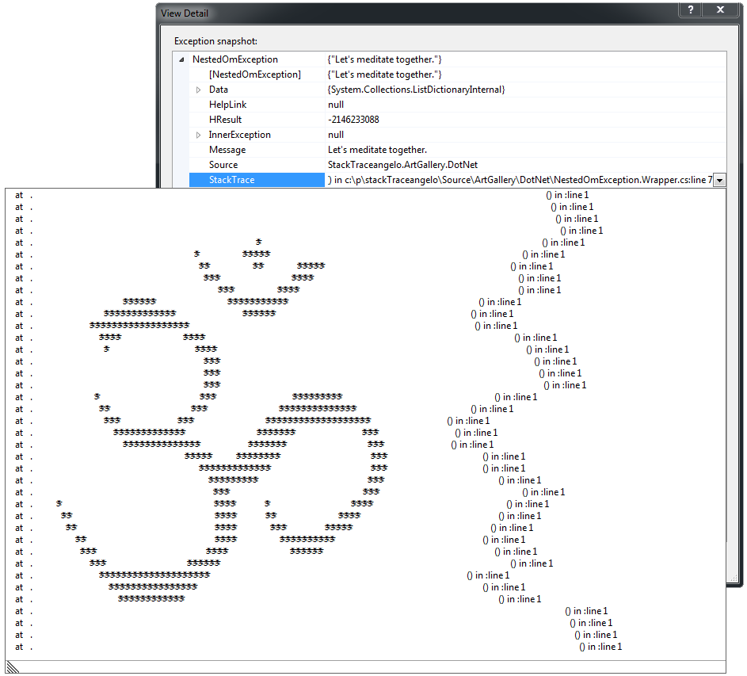

# Stack Trace Art

Stack Trace Art is the art of throwing exceptions that create beautiful drawings on callers' stack traces. You can find more about it in my [original blog post on Stack Trace Art](http://www.thehumbleprogrammer.com/stack-trace-art) and [Daniel Temkin's essay on Esoteric.Codes](http://esoteric.codes/blog/stack-trace-art).

## A few Pieces of the Finest Stack Trace Art

These pieces of the finest Stack Trace Art given below should give you an idea of what Stack Trace Art is and what kind of exceptions a programmer artist can easily create with *stackTraceangelo*. (*stackTraceangelo* is the World's first [Stack Trace Art](http://www.thehumbleprogrammer.com/stack-trace-art) editor, to my knowledge at least. Its name is the combination of the term [Stack Trace](https://en.wikipedia.org/wiki/Stack_trace) and the name of the famous renaissance artist [Michelangelo Buonarroti](https://en.wikipedia.org/wiki/Michelangelo).)

All these beautiful pieces of art are taken from the [*stackTraceangelo* Art Gallery](/Source/ArtGallery/README.md).

### Лулу и как се прави дъга
This nostalgic childhood image was inspired by a beautiful Bulgarian poem found in [Petya Kokudeva's book "Lulu"](http://www.dailymotion.com/pkokudeva#video=xm47k7).

### Keeping My Fingers Crossed
Are you looking for an artistic way to tell your colleagues that you are keeping your fingers crossed for them? Throw these two gently crossed fingers as exception and show them how much you care.

### Let's Meditate Together
Meditating together on the [sacred sound of ऊँ (Om)](https://en.wikipedia.org/wiki/Om) gets a different dimension when accompanied with the `NestedOmException`.

### Good Job!
Thinking of a unique way of congratulating your team members on a good job?

### Be Careful The Cat
Some pieces of wisdom are worth repeating over and over again. [Be careful the cat!](http://www.youtube.com/watch?v=tPAJomPCdZs).

## How Does It Work?
How Stack Trace Art works? Are those exceptions really *real* exceptions or a some kind of a fake? Out of my experience, programmer's first reaction on Stack Trace Art, and I witnessed it many times, is mostly disbelief. "These cannot be real method calls. Do you rewrite the stack trace information somehow?" I do not. Stack Trace Art exceptions are genuine, regular, real programming exceptions. No tricks of any kind ;-) Just art :-)

The "magic" behind the Stack Trace Art exceptions [is fully revealed in this blog post: His Majesty, Hangul the Filler](http://thehumbleprogrammer.com/his-majesty-hangul-the-filler/).

The inner mechanics of the *stackTraceangelo* [is explained in detail in this blog post: Clarke's Third Law Exception - Step by Step](http://thehumbleprogrammer.com/clarkes-third-law-exception-step-by-step/).

## Rekindle Your Artistic Soul
Stack Trace Art is all about rekindling our artistic programmer souls. Although (still) being in an early proof-of-concept stage, *stackTraceangelo* is already mature enough to help you draw your own pieces of Stack Trace Art. In other words, to help you rekindle your artistic soul. So, download it, create some beautiful pieces of Stack Trace Art and inject them into other programmer's code!

You still do not feel ready to start creating your own Stack Trace Art? Don't worry. Every true artist experiences the Artist's Block. To overcome the block you can seek for inspiration at the [*stackTraceangelo* Art Gallery](/Source/ArtGallery/README.md). Injecting some of the existing pieces of Stack Trace Art into your colleagues' code is a great way to [overcome the Artist's Block](https://www.wikihow.com/Overcome-Artist%27s-Block).

## Known Limitations
The [first release (0.1.0)](https://github.com/ironcev/stack-trace-art/releases/tag/v0.1.0) of the *stackTraceangelo* is just a proof of concept. Here are the main known limitations:

- The edited Stack Trace Art cannot be neither saved nor opened.

## Release Notes
All notable changes to *stackTraceangelo* are documented in the [changelog](CHANGELOG.md). Below is the excerpt from the changelog that lists only the major changes.

### 0.1.0
- The first usable prototype that offers only the basic art editing.

## License
*stackTraceangelo* is licensed under the [MIT license](LICENSE). The images in the [*stackTraceangelo* Art Gallery](/Source/ArtGallery/README.md) are licensed under the [Creative Commons CC BY 4.0 license](https://creativecommons.org/licenses/by/4.0/).