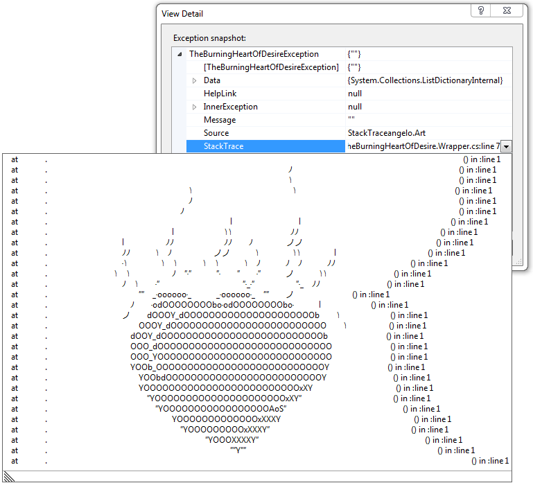
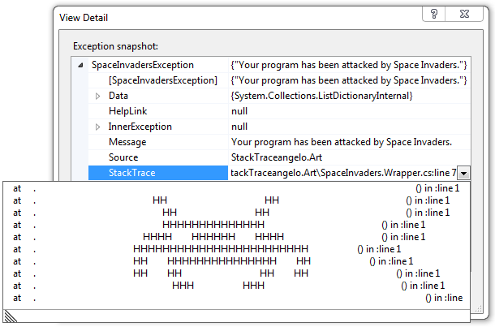

#StackTraceangelo Art Gallery

Beside empowering you to express your own creativity *stackTraceangelo* brings you a few pieces of the finest stack trace art that you can start using right away. These pieces of art are nicely packed in so called [art gallery projects](/Source/ArtGallery). There is a single art gallery project per target programming language and platform. I'm sad to say that .NET is currently the only supported platform :cry:. **Fork us and help us to create art generators for other languages and platforms.**

Using the art gallery is as simple as referencing the proper art gallery project and calling a single method. The ["Space Invaders" *stackTraceangelo* video tutorial](http://www.youtube.com/watch?v=9NpKh6uAVFM) demonstrates how easy this is. Watch the tutorial and in no time you will be able to make your colleagues believe that Space Invaders attacked their code!

So, what are you still waiting for? **Start communicating yourself right away by using the art brought to you by the *stackTraceangelo* Art Gallery.**

The content of the gallery is given below. In order of appearance. Enjoy!

##Crossed Fingers

 

##Лулу и как се прави дъга

 

##Good job!

 

##Лулу и пътуването

 

##The Burning Heart of Desire

 

##Space Invaders

 

##The Cat in the Sac
