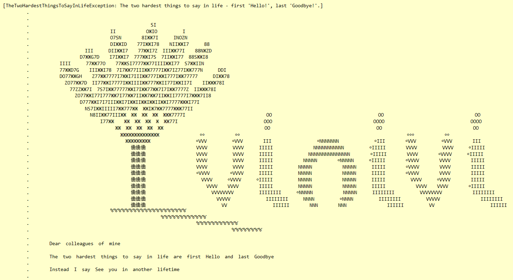

# The stackTraceangelo's Art Gallery
The stackTraceangelo's Art Gallery exhibits the finest pieces of the Stack Trace Art. The current exhibition showcases the following artwork, ordered in the reverse order of the artwork's historical appearance.

## The Two Hardest Things to Say in Life ([requested](https://github.com/ironcev/stackTraceangelo/issues/1) by [@mroncev](https://github.com/mroncev))

 

## Nested Om (ऊँ)

 

## Crossed Fingers

 

## Лулу и как се прави дъга

 

## Good job!

 

## Лулу и пътуването

 

## The Burning Heart of Desire

 

## Space Invaders

 

## The Cat in the Sac

# License
All the images are licensed under the [Creative Commons CC BY 4.0 license](https://creativecommons.org/licenses/by/4.0/).